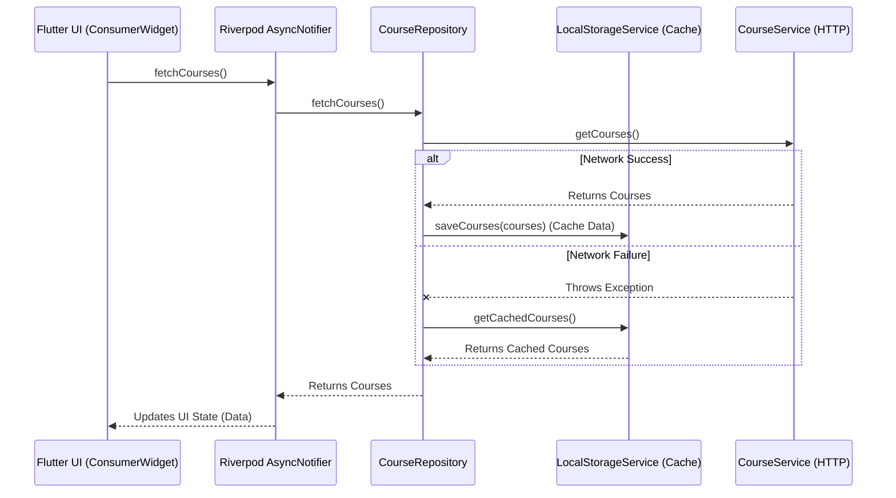
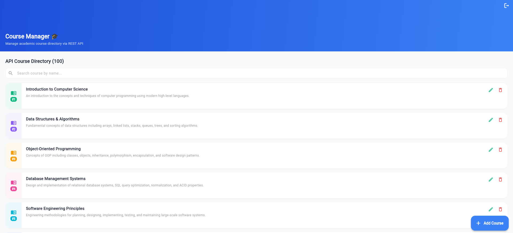
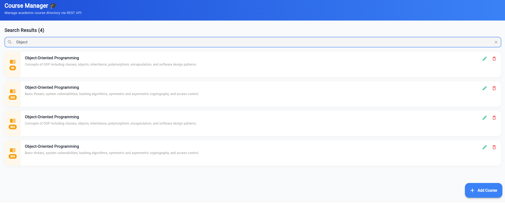
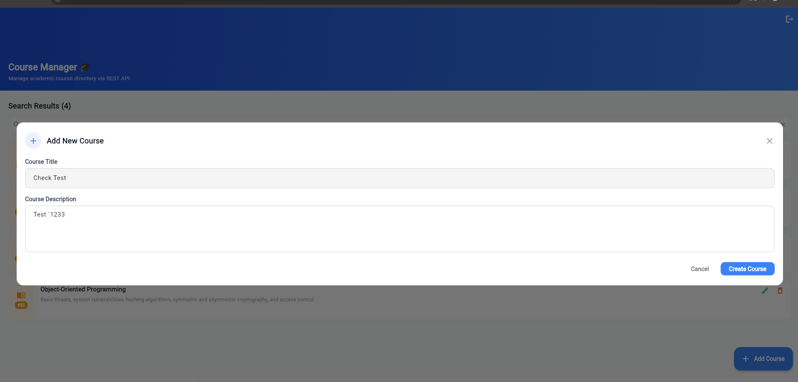
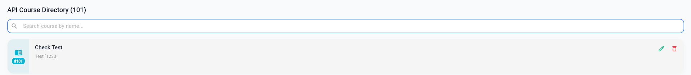
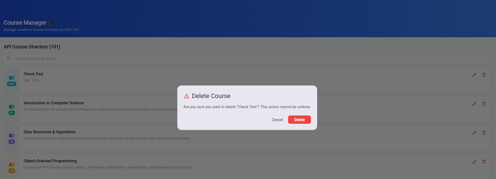
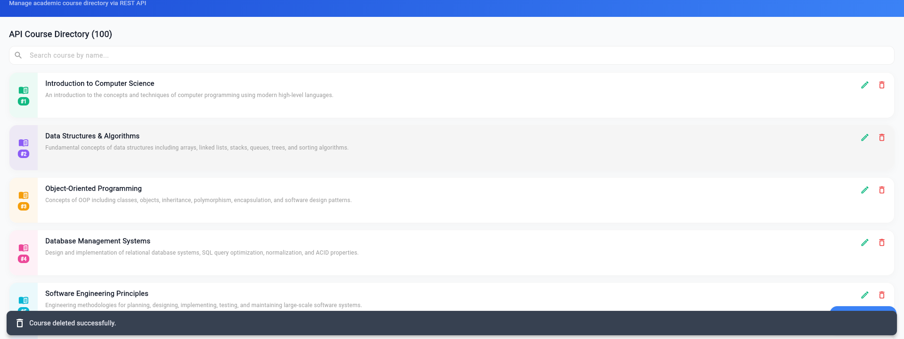

## Assignment 03: Extension Assignment Rubric Requirements

### Tools and Packages Used
- **State Management**: `flutter_riverpod` (Modern, robust provider-based state management).
- **Local Persistence**: `hive` and `hive_flutter` (Lightweight, fast NoSQL key-value database for offline caching).
- **Path Provider**: `path_provider` (Required for Hive initialization).
- **Networking**: `http` (Standard REST API calls).

### Branch Name
- `feature/offline-cache-and-state-manangement`

### Short Explanation of Offline and State Management Approach
- **State Management (Riverpod)**: Replaced `ChangeNotifier` with Riverpod's `AsyncNotifier`. This abstracts away the complexity of handling `loading`, `data`, and `error` states. The UI natively binds to these states using `ConsumerWidget`.
- **Offline Cache (Hive)**: Integrated a localized caching layer. Whenever course data is fetched successfully from the API, it is instantly serialized and stored in a Hive box.
- **Repository Pattern**: Created `CourseRepository` to act as a mediator. It attempts to fetch from `CourseService` (API). If the network request fails (e.g., offline mode), it catches the exception and falls back to loading data from `LocalStorageService` (Hive).
- **Optimistic UI Updates**: All write operations (add, update, delete) immediately manipulate the Riverpod UI state. The API call is triggered in the background. If the API fails, the state gracefully rolls back to its previous snapshot and displays an error SnackBar, ensuring no data loss and a highly responsive UX.

### Architecture Explanation
The application is structured into clearly separated layers adhering to Clean Architecture principles:
1. **UI Layer (`ConsumerWidget`)**: Listens reactively to Riverpod providers. Handles purely visual rendering and user input.
2. **State Management Layer (`AsyncNotifierProvider`)**: Manages the business logic state and optimistic UI updates.
3. **Repository Layer (`CourseRepository`)**: The single source of truth for data. It abstracts the decision between local cache and remote API.
4. **Service/Data Layer (`CourseService` & `LocalStorageService`)**: Handles raw data retrieval (HTTP requests and Hive box reads/writes).

### Screenshots
*Please scroll down to the "Extension Assignment Screenshots" section at the bottom of this README for the screenshot table.*

---

## Course API Integration

A dedicated Course Management module has been integrated into the student portal using RESTful API calls to JSONPlaceholder.

### 1. API Specifications & Reference
- **API Target:** JSONPlaceholder REST API (simulated on `/posts`)
- **Documentation Reference:** [JSONPlaceholder Guide](https://jsonplaceholder.typicode.com/guide/)
- **Methods Implemented:**
  - `GET /posts`: Retrieve the directory of courses.
  - `POST /posts`: Create a new course record (simulated).
  - `PUT /posts/{id}`: Modify an existing course record (simulated).
  - `DELETE /posts/{id}`: Remove a course record (simulated).

### 2. Version Control Branch Details
- **Branch Name:** `feature/offline-cache-and-state-manangement`

### 3. Setup and Run Instructions
To set up and run the application locally on this branch:
1. Ensure Flutter SDK is installed (`>=3.0.0 <4.0.0`).
2. Clone the repository and navigate to the project directory:
   ```bash
   cd Assignment_01_ApplicationDevelopmet-main
   ```
3. Checkout the feature branch:
   ```bash
   git checkout feature/course-api-integration
   ```
4. Fetch dependencies (including `http`):
   ```bash
   flutter pub get
   ```
5. Run the unit tests to verify the API layer:
   ```bash
   flutter test test/course_controller_test.dart
   ```
6. Run the application on your connected emulator/device:
   ```bash
   flutter run
   ```

### 4. Clean Architecture Directory Structure
The course integration follows clean, decoupled architectural patterns:
```
lib/
├── models/
│   └── course_model.dart       # Course entity definitions & JSON serialization
├── services/
│   └── course_service.dart      # Low-level network HTTP requests (GET, POST, PUT, DELETE)
├── controllers/
│   └── course_controller.dart   # Business logic, state tracking, notifying listeners via ChangeNotifier
├── widgets/
│   └── course_form_dialog.dart  # Reusable form dialog for inputting and validating titles/descriptions
└── screens/
    ├── course_list_view.dart    # Main CRUD listing screen displaying loaders, error boxes, and cards
    └── course_detail_screen.dart# Deep-dive detail screen displaying complete course body and metadata
```

### 5. API Integration Flow & Architecture Overview
The architecture is structured around the **Repository Pattern** and **Riverpod** for robust state management.

#### Offline & State Management Approach
- **State Management**: Using `AsyncNotifierProvider` to manage the Course List state securely, including robust handling for `Loading`, `Data`, and `Error` states.
- **Repository Pattern**: A new `CourseRepository` intermediates between `CourseService` (API calls) and `LocalStorageService` (Hive cache). 
- **Offline First & Fallback**: Whenever the API returns an error or fails due to network constraints, the repository seamlessly falls back to caching mechanism from `LocalStorageService`.
- **Optimistic UI Updates**: CRUD operations immediately alter the localized Riverpod state to keep the UI responsive, and then invoke the API call. If the API errors out, the state rolls back to its prior snapshot gracefully preventing data loss.



---

## Getting Started
1. Clone the repository.
2. Run `flutter pub get` to install dependencies.
3. Run the application using `flutter run`.

## Course API Integration CRUD Screenshots Checklist

To submit the assignment, please place your screen captures in a `screenshots/` directory at the root of the project with the following filenames:

| # | Screen Name / Operation | Suggested Filename | Description / Elements to Show | Status |
|---|------------------------|--------------------|---------------------------------|--------|
| 1 | **Login Screen** | `login_screen.png` | Email & Password fields, Validation/UI | Complete |
| 2 | **Dashboard / Home Screen** | `dashboard_screen.png` | Course tab visible, Navigation working | Complete |
| 3 | **Loading State** | `loading_state.png` | Shimmer/Loading skeleton active while fetching | Complete |
| 4 | **Courses Fetched from API** | `courses_loaded.png` | GET list displaying simulated course names and IDs | Complete |
| 5 | **Add Course Screen/Form** | `add_course.png` | POST dialog with form fields and Create button | Complete |
| 6 | **Successful Course Added** | `successful_course_added.png` | Snackbar notification and new item displayed | Complete |
| 7 | **Edit Course Screen** | `edit_course.png` | PUT dialog with pre-filled course title/body | Complete |
| 8 | **Updated Course Result** | `updated_course_result.png` | Updated title/content reflected in the UI list | Complete |
| 9 | **Delete Confirmation Dialog** | `delete_confirmation.png` | Confirmation Alert Dialog ("Are you sure...") | Complete |
| 10 | **Course Deleted Successfully** | `course_deleted_successfully.png` | Item removed from list and deletion Snackbar shown | Complete |
| 11 | **Error State Screen** | `error_state_screen.png` | Offline/Network loss indicator with "Try Again" | Complete |
| 12 | **GitHub Branch Screenshot** | `github_branch_screenshot.png` | Command line or Git GUI showing `feature/course-api-integration` | Complete |
| 13 | **API Service Layer Structure** | `api_service_layer_structure.png` | Folder structure showcasing clean architecture directories | Optional |
| 14 | **README Documentation Screen** | `readme_screenshot.png` | Rendered README showing branch, API ref, and setup steps | Optional |

> [!NOTE]
> **API Persistence Notice:**
> JSONPlaceholder is a fake/mock REST API. Creating, updating, or deleting courses sends requests that return simulated HTTP success statuses (e.g. `201 Created`, `200 OK`) and mock payloads, but changes are not permanently stored on the server. The application state updates reactively to display these operations locally.

---

## Assignment 2 Tasks

The following screenshots demonstrate the completion of the API Integration CRUD assignment operations:









---

### Core Screenshots Preview


---

## Assignment 03: Offline Cache & State Management Screenshots


### Extension Screenshots Preview


