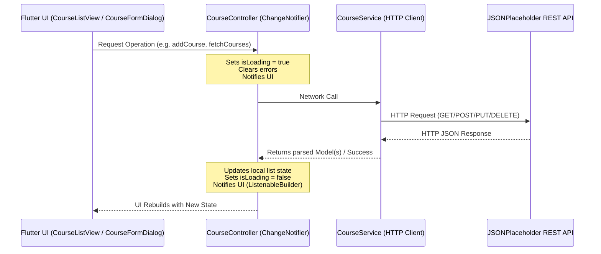

<div align="center">
  <h1>🎓 EduTrack - Student Portal Application</h1>
  <p>
    A complete, multi-screen Flutter application featuring secure user authentication, real-time form validation, and robust session persistence.
  </p>

  [](https://flutter.dev)
  [](https://dart.dev/)
  [](https://opensource.org/licenses/MIT)
</div>

---

## 👨‍🎓 Student Information
- **Name:** Muneeb Ur Rehman 
- **ID:** SE-221039
- **Institution:** [Insert University Name]
- **Course:** Application Development

---

## ✨ Features
- **Authentication System:** Secure registration and login flow with mock backend logic.
- **Form Validation:** Comprehensive real-time validation for all input fields.
- **Session Persistence:** "Remember Me" functionality using `shared_preferences`.
- **Clean Architecture:** Proper separation of UI, business logic (controllers), and data models.
- **Premium UI:** Modern design with collapsing app bars, custom gradients, and responsive layouts.

## 📱 Screens
1. **Registration Screen:** Collects First Name, Last Name, Email, Gender, and Password. Includes complex password strength validation.
2. **Login Screen:** Authenticates users and offers session persistence. Features a password visibility toggle.
3. **Dashboard:** Displays user profile info and a list of academic subjects.
4. **Detail Screen:** Provides in-depth information about selected subjects including description and schedule.

## 🛠 Tech Stack
- **Framework:** Flutter
- **Language:** Dart
- **State Management:** ChangeNotifier / ListenableBuilder
- **Networking:** HTTP (`http` package)
- **Local Persistence:** SharedPreferences

---

## 🌐 Course API Integration

A dedicated Course Management module has been integrated into the student portal using RESTful API calls to JSONPlaceholder.

### API Specifications & Reference
- **API Target:** JSONPlaceholder REST API (simulated on `/posts`)
- **Documentation Reference:** [JSONPlaceholder Guide](https://jsonplaceholder.typicode.com/guide/)
- **Methods Implemented:**
  - `GET /posts`: Retrieve the directory of courses.
  - `POST /posts`: Create a new course record (simulated).
  - `PUT /posts/{id}`: Modify an existing course record (simulated).
  - `DELETE /posts/{id}`: Remove a course record (simulated).

### Clean Architecture Directory Structure
The course integration follows clean, decoupled architectural patterns:
```text
lib/
├── models/
│   └── course_model.dart       # Course entity definitions & JSON serialization
├── services/
│   └── course_service.dart      # Low-level network HTTP requests (GET, POST, PUT, DELETE)
├── controllers/
│   └── course_controller.dart   # Business logic, state tracking, notifying listeners via ChangeNotifier
├── widgets/
│   └── course_form_dialog.dart  # Reusable form dialog for inputting and validating titles/descriptions
└── screens/
    ├── course_list_view.dart    # Main CRUD listing screen displaying loaders, error boxes, and cards
    └── course_detail_screen.dart# Deep-dive detail screen displaying complete course body and metadata
```

### API Integration Flow Overview
The data flow and state changes are driven reactively:



---

## 🚀 Getting Started
To set up and run the application locally:

1. **Clone the repository:**
   ```bash
   git clone https://github.com/muneebhere21-collab/Assignment_01_ApplicationDevelopmet.git
   cd Assignment_01_ApplicationDevelopmet
   ```
2. **Fetch dependencies:**
   ```bash
   flutter pub get
   ```
3. **Run unit tests (optional):**
   ```bash
   flutter test test/course_controller_test.dart
   ```
4. **Run the application:**
   ```bash
   flutter run
   ```

---

## 📸 Screenshots Overview

The application features a modern UI with full API CRUD integration. Screenshots are available in the `screenshots/` directory.

### Core Screenshots Preview
<div align="center">
  
  <br/><br/>
  
  <br/><br/>
  
</div>

> [!NOTE]
> **API Persistence Notice:**
> JSONPlaceholder is a mock REST API. Creating, updating, or deleting courses sends requests that return simulated HTTP success statuses (e.g., `201 Created`, `200 OK`) and mock payloads, but changes are not permanently stored on the server. The application state updates reactively to display these operations locally.

---
<div align="center">
  <i>Developed with ❤️ for Academic Excellence</i>
</div>
